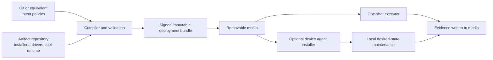

# HardenTool — product and technical specification (draft)

## 1. Purpose

HardenTool is an offline-capable desired-state and hardening system for industrial PCs, including air-gapped and brown-field OT devices. It converts a version-controlled, tooling-agnostic statement of intended device state into conservative, idempotent enforcement packages for a specific operating system and implementation backend.

It is designed to take a device from an unknown or OEM-installed state to a documented known-good state, without indiscriminately removing supplier-provided software.

## 2. Product principles

- **Offline first.** All work can be performed from removable media with no network connection.
- **Policy, not scripts.** The source of truth declares outcomes; implementation scripts are generated/selected artifacts.
- **Conservative change.** Unknown applications, drivers, and services are preserved unless an explicit policy permits their removal or alteration.
- **Idempotent convergence.** Re-running the same signed package brings the device to the same state and reports no unnecessary changes.
- **Auditable evidence.** Every run captures pre-state, intended state, actions, outcomes, and post-state in a portable report.
- **Backend independence.** Windows DSC v3 is the initial enforcement backend; Ansible and others can be added without changing the abstract policy model.
- **OT-safe operation.** Preview, approval gates, reboot coordination, rollback guidance, and low-disruption defaults are mandatory design concerns.

## 3. Core concepts

| Concept | Meaning | Example |
| --- | --- | --- |
| Intent policy | Tooling-neutral desired outcome, stored in version control | `SAP client: installed, configured, supported latest approved release` |
| Device class | Reusable policy target based on role, OS, OEM, site, or hardware | `packaging-line-hmi-windows-11` |
| Assignment | Policy/version applied to one or more identified devices | `policy v1.4.0 → asset PLC-HMI-042` |
| Backend compilation | Translation of intent into an immutable backend-specific package | DSC v3 configuration plus signed installers |
| Deployment bundle | Signed, self-contained payload copied to removable media | Runtime, policy, artifacts, manifests, reports folder |
| Device agent | Optional lightweight local service that periodically evaluates an installed assignment | Detects drift and converges only within policy limits |
| Evidence bundle | Machine-readable and human-readable result of a run | Inventory, plan, action log, hashes, exit status |

## 4. Architecture



### 4.1 Control plane (connected or controlled build environment)

The control plane is not required on the target network. It:

1. stores and reviews policy source in Git (or compatible version control);
2. resolves approved artifacts from an artifact repository such as JFrog Artifactory;
3. validates policy semantics and device compatibility;
4. compiles backend packages for a target backend/version;
5. generates an SBOM, hash manifest, signatures, and a media bundle.

### 4.2 Offline execution plane

The removable-media bundle contains everything needed to inspect and act on a target: executor runtime, backend runtime, compiled policy, referenced artifacts, trusted public keys, manifest, and report storage. It must not fetch files during a target run.

The launcher supports:

- **Assess only:** inventory and compatibility checks, no state changes.
- **Plan:** compare observed state with desired state and show/export proposed actions.
- **Apply once:** execute approved changes and write evidence to media.
- **Install agent:** apply bootstrap policy and install the local maintenance agent.
- **Collect OEM drivers:** extract installed driver packages to media without changing the device.

## 5. Two-level configuration-as-code model

### 5.1 Level 1: intent policy

Intent policies describe *what* must be true, not the command or tool used to make it true. They use stable domain concepts such as application, account, service, update posture, local security setting, firewall rule, and device capability.

Illustrative policy:

```yaml
apiVersion: hardentool/v1
kind: DevicePolicy
metadata:
  name: packaging-line-hmi
  version: 1.4.0
spec:
  compatibility:
    os: windows-11-iot-enterprise
    architecture: x64
  applications:
    - id: sap-gui
      state: present
      channel: approved-latest
      configurationProfile: sap-production
    - id: onedrive
      state: absent
      removalClass: approved-removable
  services:
    - id: xboxgip
      state: disabled
  security:
    baseline: cis-windows-11-iot-level-1
  preservation:
    unknownApplications: preserve
    supplierApplications: preserve
    driverStore: preserve
  reboot:
    strategy: require-operator-approval
```

The policy schema must support:

- versioned, named policies and reusable modules;
- constraints (`required`, `preferred`, `forbidden`, `preserve`);
- applicability predicates (OS build, architecture, device class, hardware, site);
- approved version channels, pinned versions, and configuration profiles;
- named removal classifications and justification/approval requirements;
- reboot and service-interruption constraints;
- exception records with owner, reason, scope, expiry, and approval;
- policy references pinned by content digest when bundled.

### 5.2 Level 2: compiled backend configuration

A compiler maps valid intent into backend-specific implementation, such as DSC v3 resources and PowerShell operations for Windows. This layer is generated or selected from a versioned compiler/backend adapter; operators do not hand-edit it on target media.

Every compiled artifact records:

- source policy name, version, commit, and digest;
- compiler and backend adapter versions;
- artifact digests and provenance;
- compatibility requirements;
- the exact implementation actions derived from each policy statement.

The initial backend adapter targets Windows DSC v3. A later Ansible adapter must consume the same level-1 intent schema and produce functionally equivalent plans/evidence, rather than introduce a separate policy language.

## 6. Device discovery and safe classification

Before any enforcement, HardenTool creates an inventory snapshot including OS/build, patches, installed applications, Windows features, services, local users/groups, security configuration, network configuration, disks, certificates, scheduled tasks, driver store, hardware identity, and relevant event logs.

Classification compares this snapshot to an assignment selector. If a device cannot be confidently matched, the default is **assess-only / no changes**. An operator may make an explicit, logged override where policy permits it.

Suggested identity fields: organisation asset ID, serial number, BIOS UUID, Windows machine GUID, MAC addresses (informational only), model, and configured site/role tags.

## 7. Preservation and removal policy

The default posture is preservation. HardenTool must distinguish:

1. **Required:** explicitly needed and verified by policy.
2. **Approved removable:** known unwanted software or features explicitly allowed for removal (for example OneDrive consumer client, Solitaire, Xbox components where applicable).
3. **Supplier/OEM protected:** discovered or declared supplier components that cannot be removed without a scoped exception.
4. **Unknown:** retained and reported; never auto-removed.

Removal requires all of the following: a policy rule, a known package identity/detection rule, an applicable device match, a previewed action, and no protected classification. The executor must never use blanket debloat lists or remove arbitrary installed software merely because it is absent from the desired application list.

## 8. Artifacts, updates, and trust

Artifacts include application installers, configuration files, backend resources, agent binaries, policy bundles, and approved driver packages. Each is immutable, content-addressed, versioned, and accompanied by provenance and hash data.

The removable-media bundle has a signed manifest enumerating every file and its SHA-256 digest. The executor verifies the manifest and signing chain before acting; failures stop execution before any state change. The trust root and allowed signing certificates are pinned in the executor/bootstrap trust store.

### Tool self-update

The bundle builder may include a newer core runtime from the approved repository. On target, self-update must be staged and atomic:

1. validate signature, publisher, compatibility, and hash;
2. retain the currently running version;
3. install/activate the update only at a safe process boundary;
4. record previous/new versions and update result;
5. fall back to the last known working runtime if startup validation fails.

No target should update from an unverified USB payload or the public internet.

## 9. Execution lifecycle

1. **Verify bundle** — validate manifest, signatures, free space, supported OS, privileges, and media writeability.
2. **Inventory** — capture an immutable pre-state snapshot.
3. **Classify** — resolve the target assignment; fail safely on ambiguity.
4. **Plan** — derive actions, blockers, expected reboots, disruption impact, and rollback notes.
5. **Approve** — require an operator acknowledgement for apply mode, especially removals/reboots/security-impacting changes.
6. **Apply** — execute idempotent backend operations in a defined order.
7. **Verify** — test declared postconditions and application health checks.
8. **Record** — write signed/tamper-evident evidence, post-state, and a summary to media.

Failed or incomplete runs are resumable only after re-inventory and plan revalidation. The report must clearly identify partial convergence; it must not claim compliance from a successful process exit alone.

## 10. Idempotency and application verification

Each resource implements detect → plan → apply → verify. A resource must be able to say whether it is compliant, what it would change, and whether it changed anything.

Application `present` is not satisfied only by an MSI/product code. Policy supports health checks such as executable version, Windows service running, expected configuration file digest, endpoint reachability where safe, or a vendor-provided local diagnostic. Health checks must be declarative, bounded by timeout, and never require internet access.

## 11. Device agent

The optional agent is installed from the same signed media bundle and runs with the minimum required local privileges. It stores the pinned assignment and compiled policy locally, evaluates on a controlled schedule or operator trigger, and writes evidence to a configured removable-media export location when media is present.

For air-gapped deployments, policy and artifact changes arrive by signed removable media import. The agent must not independently download updates. Its default behaviour should be assess/report drift; automated remediation must be an explicit policy choice, with protected/removal actions requiring stronger approval rules.

## 12. OEM driver capture and recovery

The **Collect OEM drivers** operation exports third-party packages from the Windows driver store (for example using the supported OS driver-export facility) to a uniquely named folder on media. It also records hardware IDs, driver versions, provider, published name, signature status, and a hash manifest.

Driver extraction is read-only. Reinstalling drivers is a separately planned operation that requires explicit matching and signature validation. A baseline bundle may include recovery guidance and OEM driver evidence, but cannot promise full rollback for every vendor installer or firmware change.

## 13. Evidence and reporting

Every execution writes a run folder to media, for example:

```text
runs/<device-id>/<utc-run-id>/
  summary.json
  summary.html
  pre-state.json
  plan.json
  actions.jsonl
  post-state.json
  verification.json
  artifacts-used.json
  drivers/                    # only when collected
  manifest.json
  signatures/
```

The report includes device identity, policy/assignment/compiler/backend versions, operator identity if available, UTC timestamps, hashes, planned versus completed actions, no-op resources, failures, reboots, exceptions, and final compliance by control. Sensitive material must be excluded or redacted; secrets are never written to removable-media logs.

## 14. Security requirements

- Code-sign executables, scripts, compiled configurations, and manifests.
- Verify signatures and hashes before execution; fail closed.
- Use least privilege and separate normal assessment from elevated enforcement.
- Keep secrets out of policy source and media logs; use encrypted, scoped offline secret packages only when necessary.
- Protect evidence integrity with signatures or an append-only hash chain.
- Record all overrides, approvals, exceptions, and trust changes.
- Support an offline certificate/key rotation process with overlapping trusted keys and expiry checks.
- Require explicit policy controls for firewall, remote access, local accounts, antivirus exclusions, and disabling operational services.

## 15. Initial scope and delivery phases

### Phase 1 — offline assessment and Windows hardening

- Windows-only launcher and signed media-bundle verification.
- Inventory, device classification, assess/plan/apply modes, and evidence export.
- Intent schema covering applications, services, basic security settings, and preservation/removal classes.
- DSC v3 backend adapter.
- Curated hardening/removal controls for explicitly named consumer bloatware and services.
- OEM driver-store export.

### Phase 2 — maintained desired state

- Optional agent installation and removable-media import/export workflow.
- richer app configuration/health-check model;
- reusable policy modules, exception workflow, and compliance aggregation from imported evidence;
- staged tool/runtime updates.

### Phase 3 — multiple backends and orchestration

- Ansible backend adapter and parity test suite;
- push orchestration for connected/controlled networks;
- additional OS support only after the abstract schema has proven stable.

## 16. Acceptance criteria for the first usable release

1. A signed offline bundle can assess a supported Windows industrial PC without network access.
2. The bundle refuses to apply when its manifest/signature is invalid, compatibility fails, or no unambiguous assignment is found.
3. It applies a selected Windows hardening policy twice with the second run producing no unnecessary changes.
4. It can install/update/configure an approved application from bundled artifacts and verify a declared local health check.
5. It removes only explicitly approved and positively identified unwanted software; unknown and supplier-protected software remain untouched.
6. It captures pre-state, plan, action results, post-state, and verification results to removable media.
7. It exports a brown-field Windows device's third-party driver packages and accompanying metadata without modifying the device.
8. Every report identifies the exact policy, compiler/backend, artifacts, and runtime versions used.

## 17. Open design decisions

- What authoritative asset inventory and device-class taxonomy will provide assignment data?
- Which Windows editions/builds and hardware architectures are supported first?
- Who can sign policy bundles, artifacts, and tool updates, and how are offline keys protected/rotated?
- Which controls are safe for unattended remediation versus report-only on production OT devices?
- What local authentication/operator identity mechanism is available on air-gapped devices?
- Is collected evidence only returned by media, or later ingested into a central compliance service?
- What is the approved baseline and vendor exception process for each device family?
